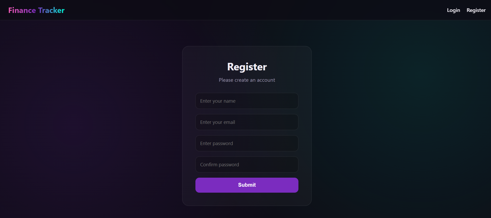
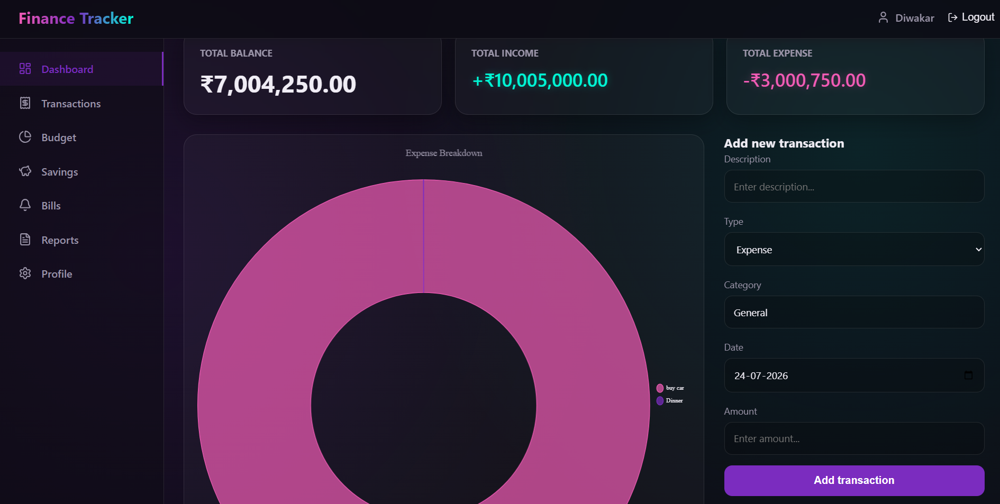
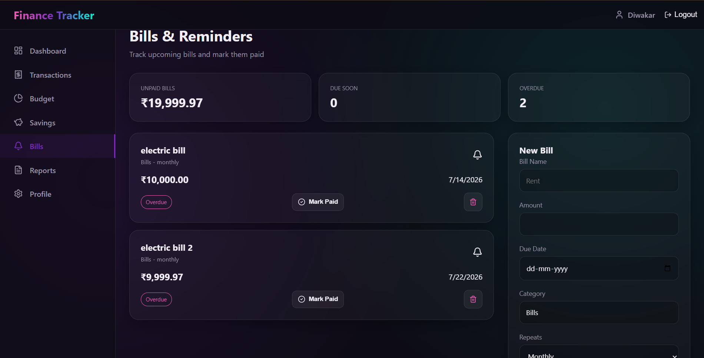
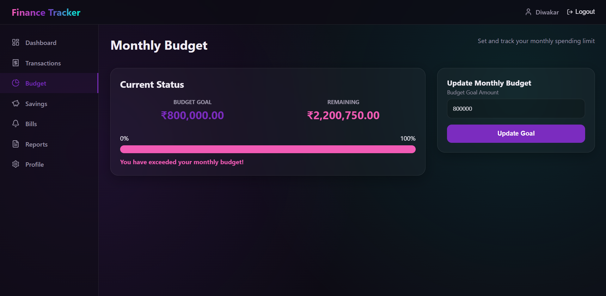
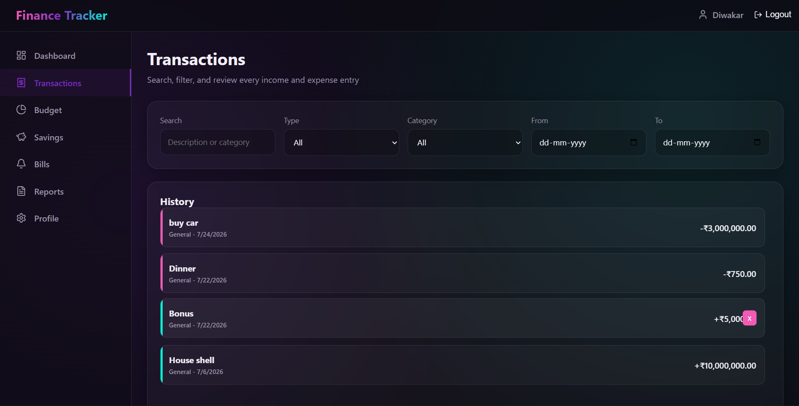
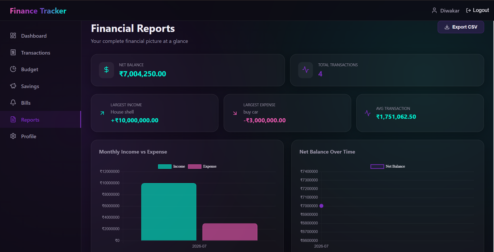

# 💰 Personal Finance Tracker

A full-stack **Personal Finance Tracker** built with the **MERN Stack (MongoDB, Express.js, React.js, Node.js)**. This application helps users efficiently manage their personal finances by tracking income, expenses, budgets, and account balances through a clean and responsive interface.

---

## 🚀 Features

- 🔐 Secure User Authentication (JWT)
- 👤 User Registration & Login
- 💵 Add, Edit, and Delete Income
- 💸 Add, Edit, and Delete Expenses
- 📊 Interactive Dashboard
- 📈 Income vs Expense Summary
- 💰 Automatic Balance Calculation
- 🏷️ Category-wise Expense Tracking
- 📅 Transaction History
- 🔍 Search & Filter Transactions
- 📱 Responsive UI for Mobile & Desktop

---

## 🛠️ Tech Stack

### Frontend
- React.js
- HTML5
- CSS3
- JavaScript (ES6)
- Bootstrap

### Backend
- Node.js
- Express.js

### Database
- MongoDB
- Mongoose

### Authentication
- JWT (JSON Web Token)
- bcrypt.js

### Tools
- Git
- GitHub
- VS Code
- Postman

---

## 📂 Project Structure

```
Personal-Finance-Tracker
│
├── client/
│   ├── public/
│   ├── src/
│   ├── components/
│   ├── pages/
│   ├── App.js
│   └── package.json
│
├── server/
│   ├── config/
│   ├── controllers/
│   ├── middleware/
│   ├── models/
│   ├── routes/
│   ├── server.js
│   └── package.json
│
├── screenshots/
│   ├── login.png
│   ├── register.png
│   ├── dashboard.png
│   ├── add-income.png
│   ├── add-expense.png
│   └── transactions.png
│
├── README.md
└── .gitignore
```

---

## ⚙️ Installation

### 1. Clone the Repository

```bash
git clone https://github.com/dry-shy/Personal-Finance-Tracker.git
```

### 2. Navigate to the Project

```bash
cd Personal-Finance-Tracker
```

### 3. Install Backend Dependencies

```bash
cd server
npm install
```

### 4. Install Frontend Dependencies

```bash
cd ../client
npm install
```

---

## ▶️ Run the Application

### Start Backend

```bash
cd server
npm run dev
```

### Start Frontend

```bash
cd client
npm start
```

The application will run at:

```
Frontend : http://localhost:3000
Backend  : http://localhost:5000
```

---

## 🔑 Environment Variables

Create a `.env` file inside the **server** folder.

```env
PORT=5000
MONGO_URI=your_mongodb_connection_string
JWT_SECRET=your_secret_key
```

---

## 📷 Screenshots

### Register Page



---

### Dashboard



---

### Bills



---
### Budget



---

### Transaction History



### Report


---

## 🔮 Future Enhancements

- 📊 Charts & Graphs
- 📅 Monthly Expense Reports
- 💹 Budget Planning
- 📤 Export Transactions (PDF/Excel)
- 🌙 Dark Mode
- 🔔 Email Notifications
- 🤖 AI-based Spending Insights
- 💱 Multi-Currency Support

---

## 👨‍💻 Author

**Diwakar Yadav**

- 🎓 B.Tech - Computer Science & Engineering
- 💻 MERN Stack Developer

### GitHub

https://github.com/dry-shy

### LinkedIn

https://www.linkedin.com/in/your-linkedin-profile/

---

## ⭐ Show Your Support

If you found this project helpful, please give it a ⭐ on GitHub.

---

## 📄 License

This project is licensed under the **MIT License**.
